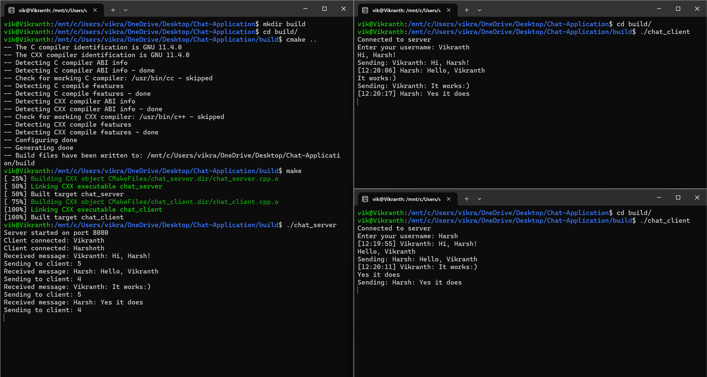

# Chat Application

This project implements a simple chat application comprising a C++ server and a C++ client. The server is capable of handling multiple client connections simultaneously, facilitating real-time message exchange between connected clients.



## Project Structure

```
Chat-Application/
    ├── chat_server.cpp
    ├── chat_client.cpp
    ├── CMakeLists.txt
    ├── Makefile
    ├── .gitignore
    ├── LICENSE
    └── README.md
```

## Features

- **Multi-client Support**: The server can handle multiple clients simultaneously, enabling real-time communication between users.
- **Real-time Messaging**: Clients can send and receive messages in real-time.
- **User Identification**: Each client provides a username upon connection, which is displayed with their messages.
- **Timestamped Messages**: Messages are timestamped to show when they were sent.

## Requirements

- C++ compiler (GCC, Clang, or MSVC)
- CMake (for CMake build)

## Building the Project

### Using CMake

1. **Create the build directory and compile the project**:

    ```bash
    mkdir build
    cd build
    cmake ..
    make
    ```

2. **Run the server**:

    ```bash
    ./chat_server
    ```

3. **Run the client**:

    ```bash
    ./chat_client
    ```

### Using Makefile

1. **Compile the project**:

    ```bash
    make
    ```

2. **Run the server**:

    ```bash
    ./chat_server
    ```

3. **Run the client**:

    ```bash
    ./chat_client
    ```

## Running the Application

1. **Start the Server**: Ensure the server is running by executing `./chat_server` as described above.
2. **Connect Clients**: Open multiple terminals and run the client in each terminal to simulate multiple users. Execute `./chat_client` in each terminal.
3. **Enter Username**: Each client will prompt for a username upon connection.
4. **Start Chatting**: Begin sending and receiving messages. Each message will be timestamped and display the sender's username.

## Example Usage

1. **Start the Server**:
    ```bash
    ./chat_server
    ```
    Output:
    ```
    Server started on port 8080
    ```

2. **Connect Clients**:
    ```bash
    ./chat_client
    ```
    Output:
    ```
    Connected to server
    Enter your username: user1
    ```

3. **Send and Receive Messages**:
    - Client 1 (`user1`):
        ```plaintext
        Hello, everyone!
        ```
    - Client 2 (`user2`):
        ```plaintext
        Hi user1!
        ```
    - Server output:
        ```
        Client connected: user1
        Client connected: user2
        Received message: [12:34:56] user1: Hello, everyone!
        Received message: [12:35:01] user2: Hi user1!
        ```

## File Descriptions

- **chat_server.cpp**: The C++ server code that handles multiple clients, manages message broadcasting, and timestamps messages.
- **chat_client.cpp**: The C++ client code that connects to the server, sends messages, and displays incoming messages.
- **CMakeLists.txt**: CMake configuration file for building the project.
- **Makefile**: Makefile for building the project.

## License

This project is licensed under the [MIT License](LICENSE).